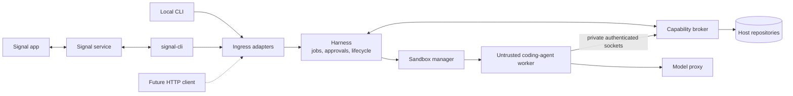

# Pocket Agent

A secure remote wrapper around replaceable coding agents running on your machine.

Pocket Agent owns authenticated ingress, isolation, credential mediation, scoped host capabilities, disposable workspaces, audit, and lifecycle—not agent reasoning, prompt ecosystems, or IDE behavior. Pi is the first agent runtime behind the worker protocol rather than part of the trusted host.

The local CLI, Signal, and future authenticated HTTP endpoints are ingress adapters to the same job harness. An ingress can start a Pi task in an allowlisted repository, receive progress and final output, answer approvals, steer or cancel work, and switch between sessions. MCP tools are exposed through a deny-by-default gateway.

> **Early MVP:** use on a development machine with backups. Pi and its built-in tools run only in a constrained disposable Docker or native macOS worker. The authenticated broker exposes only scoped workspace operations, and a job-scoped host proxy keeps provider credentials out of workers.

## Ingress adapters

Signal was the first remote adapter because it supports a private, self-hosted workflow through the unofficial `signal-cli` daemon without a public webhook. It is not the harness entry point or part of the domain model. The Rust host exposes Signal beside its first-class local CLI as an optional adapter. See [ADR 0001](docs/adr/0001-rust-host-and-ingress-adapters.md) and [`docs/rust-host.md`](docs/rust-host.md).

The product boundary and non-negotiable feature rules are recorded in the [`architectural review`](docs/architectural-review.md) and [ADR 0002](docs/adr/0002-secure-wrapper-not-agent-framework.md).

## Architecture



Arbitrary agent-selected commands run only inside a disposable worker. The worker receives a repository copy, not the original host checkout, and has no host home directory, Docker socket, or long-lived credentials. Privileged actions cross an authenticated MCP seam where the trusted capability broker validates job identity, scope, normalized arguments, policy, and operator approval. The broker exposes typed capabilities and never a generic host shell.

Pi execution and built-in tools run in the isolated worker; the host package does not install or initialize Pi. The host issues short-lived, job-scoped broker and model-proxy leases over private Unix sockets with policy checks, limits, revocation, and redacted audit records. Curated workspace capabilities can submit and review a patch; applying it is a separate approved operation. Provider credentials remain in the trusted host. See [`docs/architecture.md`](docs/architecture.md), [`docs/isolation-verification.md`](docs/isolation-verification.md), [`docs/capability-broker.md`](docs/capability-broker.md), [`docs/model-proxy.md`](docs/model-proxy.md), and [`docs/workspaces.md`](docs/workspaces.md).

The deep seams are intentionally small:

- `Harness`: accepts transport-neutral commands identified by principal and conversation and emits structured replies.
- Ingress adapters authenticate principals and translate CLI, Signal, or future HTTP traffic at that seam.
- `JobFactory` / `JobHandle`: create, run, steer, cancel and dispose isolated jobs without exposing Docker or workspace details to the harness.
- `JobEventPort`: reports status and requests one-operation approvals during a turn.

## Current capabilities

The Rust host now supports a one-turn CLI and an interactive shell:

```bash
# From a Git worktree, --repo defaults to the current project.
cargo run --release -- --config ./config.json run --prompt "Fix the parser"
cargo run --release -- --config ./config.json run --bug "Parser panics on empty input"
cargo run --release -- --config ./config.json shell

# An explicit configured alias remains available.
cargo run --release -- --config ./config.json run --repo app --prompt "Fix the parser"
```

Both local commands and `serve signal` use the configured isolated worker, disposable workspace, scoped capability broker, and host-only model credential path:

```bash
cargo run --release -- --config ./config.json serve signal
```

- `/new <repo> <task>` starts a persistent Pi conversation through Signal.
- `/bug <repo> <description>` asks Pi to reproduce, fix and test a bug.
- Plain text or `/steer` continues/redirects the selected session.
- `/answer` resolves agent questions, Pi tool approvals and MCP approvals.
- `/cancel`, `/jobs`, `/use`, and `/status` control concurrent sessions.
- Incoming senders and repositories are host-configured allowlists.
- Jobs use bounded disposable repository snapshots; candidate patches are exported with a changed-file manifest while the original checkout remains untouched.
- Pi writes and shell calls default to explicit approval.
- Privileged host operations are available only through authenticated, job-scoped broker capabilities.
- Signal group messages are ignored in the MVP; only allowlisted private senders are accepted.

## Prerequisites

- Rust 1.88+ to build the trusted host
- One job sandbox runtime:
  - Docker with a native Linux daemon, or
  - macOS on Apple Silicon with Homebrew Node for the native Seatbelt runner
- Optional: Docker plus a Signal account for the Signal ingress. Linking `signal-cli` as a secondary device is recommended.

## The worker image

The pinned, multi-platform worker image packages Pi and baseline build tools under numeric UID/GID `65532`. Its protocol entrypoint owns the in-memory Pi session, built-in tools, steering, cancellation, status, and tool approvals. It runs with a read-only root filesystem and contains no credentials or container client. See [`docs/worker-image.md`](docs/worker-image.md) for builds, hardened smoke tests, SBOM inspection, and the update procedure. The Rust [`DockerJobFactory`](docs/docker-sandbox.md) adds per-job resource, filesystem, network, lifecycle, and cleanup controls. Apple Silicon Macs may instead use the Docker-free [`NativeJobFactory`](docs/native-macos-sandbox.md), which runs the same worker under Seatbelt with weaker resource controls.

## The Signal image

The repository builds its own image from [`docker/signal-cli/Dockerfile`](docker/signal-cli/Dockerfile). It does **not** download or run `signal-cli-rest-api`.

The long-running image contains only:

- the upstream `signal-cli` native executable;
- its required glibc, libgcc, and zlib runtime files;
- CA certificates needed to reach Signal.

The final image is `FROM scratch`: it has no shell, package manager, curl, Java runtime, or wrapper web application. The upstream `signal-cli` archive is pinned to version `0.13.20` and verified during the build against its published SHA-256 digest. The Debian build-stage image is also digest-pinned.

A separate one-off `link-helper` build target contains `qrencode` and a shell solely to display the device-link QR code. It is not used by the long-running daemon.

## Installation

### 1. Install the trusted host

Install from a reviewed checkout:

```bash
git clone https://github.com/josebarrueta/pocket-agent.git
cd pocket-agent
cargo install --locked --path .
pocket-agent --help
```

To avoid installing into `~/.cargo/bin`, use `cargo build --release --locked` and run `./target/release/pocket-agent` instead. The resulting host is a single stripped Rust binary. Node is needed on the host only when using the native macOS runner.

### 2. Build an immutable worker

For a local, single-platform installation, build the worker and record its immutable image ID:

```bash
docker buildx build \
  --load \
  --file docker/worker/Dockerfile \
  --tag pocket-agent/worker:local \
  --iidfile .pocket-agent-worker.iid \
  .
cat .pocket-agent-worker.iid   # sha256:...
```

Set `sandbox.image` to that complete `sha256:...` value. A registry deployment may instead use `registry.example/worker@sha256:...`; see [`docs/worker-image.md`](docs/worker-image.md) for multi-platform publishing and verification.

On an Apple Silicon Mac, Docker can instead be skipped for coding jobs:

```bash
npm ci --ignore-scripts --prefix docker/worker
```

Start from `config.native-macos.example.json`, or configure `sandbox.runner` as `native`, remove `image`, and set `nodePath` and `workerPath` to absolute paths:

```json
{
  "sandbox": {
    "runner": "native",
    "nodePath": "/opt/homebrew/bin/node",
    "workerPath": "/absolute/path/to/pocket-agent/docker/worker/worker.mjs"
  }
}
```

See [`docs/native-macos-sandbox.md`](docs/native-macos-sandbox.md) for the security and resource-control differences.

### 3. Configure and run

```bash
cp config.example.json config.json
```

Edit `config.json`:

- `repositories`: safe aliases mapped to absolute Git worktree roots. They are mandatory for Signal/remote ingress. Local `run` and `shell` may omit `--repo`; Pocket Agent then canonicalizes the enclosing current Git worktree into a process-local alias.
- Docker runner: `sandbox.dockerPath` and a digest-pinned `sandbox.image`.
- Native macOS runner: absolute `sandbox.nodePath` and `sandbox.workerPath`; no image is required.
- `agent.model`: a fixed `provider/model-id`. `anthropic/...` uses Anthropic Messages; other providers use the OpenAI-compatible adapter.
- `agent.apiKeyEnv`: the name of the host environment variable containing the provider key.
- `agent.baseUrl`: optional trusted HTTPS endpoint for an OpenAI-compatible provider.
- `permissions`: `allow`, `ask`, or `deny` for worker reads, writes, and shell calls.
- `signal`: optional for CLI use; remove it entirely unless using `serve signal`.

Export only the configured host credential, then run a job:

```bash
export ANTHROPIC_API_KEY='...'
pocket-agent --config ./config.json run \
  --repo website \
  --prompt "Find the failing checkout test, fix it, and run the focused test suite"
```

The original checkout is not mounted into the worker, including in current-directory mode. Pocket Agent snapshots the project into a bounded disposable workspace. The command prints the result and a changed-file manifest for the candidate patch.

### Optional Arcade MCP Gateway

On macOS, local CLI jobs can use a curated Arcade MCP Gateway without an Arcade API key. Configure the non-secret gateway slug and explicitly pin each exposed tool:

```json
{
  "connectors": {
    "arcade": {
      "gatewaySlug": "YOUR-GATEWAY-SLUG",
      "requestTimeoutMs": 30000,
      "maxCallsPerJob": 30,
      "maxRequestBytes": 65536,
      "maxResponseBytes": 262144,
      "tools": [
        {
          "name": "arcade.github_get_issue",
          "upstreamName": "GitHub.GetIssue",
          "description": "Read one GitHub issue from the authorized account.",
          "inputSchema": {
            "type": "object",
            "properties": {
              "owner": { "type": "string", "maxLength": 100 },
              "repo": { "type": "string", "maxLength": 100 },
              "number": { "type": "integer", "minimum": 1 }
            },
            "required": ["owner", "repo", "number"],
            "additionalProperties": false
          },
          "policy": "allow"
        }
      ]
    }
  }
}
```

The pinned `upstreamName` and `inputSchema` must exactly match the tool currently exposed by the Arcade gateway. Pocket Agent refuses schema drift instead of silently broadening authority. Use `"policy": "ask"` for mutating tools and `"deny"` to keep a configured tool hidden.

The first tool call prints an Arcade browser-authorization URL. Complete it on the same Mac; Pocket Agent receives the PKCE callback on loopback and stores the gateway registration and tokens in macOS Keychain. Arcade retains downstream GitHub, Linear, Datadog, and other tool grants. Later jobs and process restarts reuse and refresh those grants. Tool-level authorization may print another Arcade URL; complete it and explicitly retry the operation. Mutating calls are never replayed automatically.

The connector is intentionally available only to local CLI principals in this first slice. Workers still have no general network access and receive no gateway or downstream tokens. To switch accounts or recover from a revoked/corrupt grant, delete the local gateway grant and authorize again on the next tool call:

```bash
pocket-agent --config ./config.json arcade logout
```

Signal/User Source support and non-macOS credential stores remain future work. Follow [How to use an Arcade MCP Gateway](docs/how-to-use-arcade-mcp.md) for setup, authorization, policy guidance, examples, and troubleshooting. The detailed design is in [`docs/stories/add-curated-mcp-connector.md`](docs/stories/add-curated-mcp-connector.md).

### Install with your favorite coding harness

If you prefer agent-assisted setup, paste this into your preferred coding harness from the directory where you want the checkout:

```text
Clone https://github.com/josebarrueta/pocket-agent.git and install its Rust host
using the locked dependencies. Build the reviewed Docker worker and save its immutable
sha256 image ID. Copy config.example.json to config.json, but do not invent repository
paths, provider credentials, or Signal identities. Ask me for those values, keep secrets
out of files and command output, validate with cargo fmt, clippy, and test, then show me
the exact pocket-agent CLI command for a one-turn run. Do not weaken image pinning,
Docker isolation, sender allowlists, or approval defaults.
```

The setup agent may build and validate the project, but you should supply credentials yourself and perform Signal device linking manually.

## Optional Signal installation

The CLI requires no Signal configuration. To enable Signal, configure `signal.account`, `signal.allowedSenders`, and `signal.daemonUrl`, then link the minimal daemon:

```bash
mkdir -p signal-cli-data
chmod 700 signal-cli-data

# Build only from this repository's reviewed Dockerfile.
docker compose build --pull

# One-time linking. Scan the QR in Signal under Settings → Linked devices → +.
docker compose --profile setup run --rm signal-link

# Start the daemon and verify it before starting the ingress.
docker compose up -d signal-cli
curl --fail http://127.0.0.1:8080/api/v1/check
pocket-agent --config ./config.json serve signal
```

Send `/help` to the linked account from an allowlisted private Signal account. Group and sync messages are ignored.

On Linux, the Signal container runs as UID/GID `65532`. If linking reports a permission error, run `sudo chown -R 65532:65532 signal-cli-data` before retrying. Keep this directory private and backed up because it contains linked-device cryptographic material; never run the link helper while the daemon is using the same database.

On Apple Silicon, Compose runs the upstream x86-64 native Signal release under emulation. More importantly, Docker Desktop cannot forward the host capability/model Unix sockets through its VM, so coding jobs fail closed there; use a native Linux Docker host for the complete system.

## Example conversation

```text
You: /bug website checkout hangs after an expired session
Bot: 🚀 [ab12cd34] Starting in website.
Bot: 🔧 read
Bot: ❓ [1] Allow Pi tool bash?
     { "command": "npm test -- checkout" }
     Reply: /answer 1 <answer>
You: /answer 1 yes
Bot: ✅ [ab12cd34]
     Reproduced the race, fixed ..., and all checkout tests pass.
```

## Signal container controls

The daemon runs as numeric user `65532`, with a read-only root filesystem, all Linux capabilities dropped, `no-new-privileges`, and bounded CPU/memory/PIDs. Its sole persistent writable mount is `signal-cli-data`. Port 8080 is published on loopback only. A size-capped ephemeral `/tmp` is executable because the native image must extract and load its bundled `libsignal`; it remains `nosuid,nodev` and disappears with the container.

The container necessarily has outbound network access to communicate with Signal. Pocket Agent talks directly to `signal-cli`'s HTTP JSON-RPC and SSE endpoints; there is no third-party REST wrapper in between. Container isolation reduces attack surface but is not a perfect security boundary, especially under Docker Desktop's VM and x86 emulation.

To inspect exactly what will run:

```bash
docker compose build signal-cli
docker image history --no-trunc pocket-agent/signal-cli:0.13.20
docker inspect pocket-agent/signal-cli:0.13.20
```

## Capability safety model

The old host-side MCP extension was removed with host-side Pi. MCP servers are executable programs, not passive tool descriptions, so workers reach privileged operations only through the authenticated, scoped capability broker. The broker always registers curated workspace metadata and candidate-patch operations and may register explicitly configured Arcade tools; it exposes no host path, generic shell, arbitrary endpoint, or dynamic MCP passthrough. Docker workers retain `network=none` and receive no host or provider credentials. Native Linux Docker supports the private Unix-socket mount; Docker Desktop for macOS fails capability access closed because its VM cannot forward host Unix sockets. The native macOS runner reaches the same sockets directly through explicit Seatbelt rules.

## Deliberate MVP limits / roadmap

1. Add narrowly scoped connector capabilities, beginning with the [curated Arcade MCP Gateway story](docs/stories/add-curated-mcp-connector.md).
2. Add crash-safe controller job metadata restoration; worker Pi sessions are intentionally in-memory today.
3. Add an official WhatsApp adapter.
4. Add attachments, schedules, and richer progress summaries.

## Development

```bash
cargo fmt --all -- --check
cargo clippy --locked --all-targets --all-features -- -D warnings
cargo test --locked

# Native Linux Docker parity matrix after building the two test images
POCKET_AGENT_DOCKER_TEST_IMAGE=pocket-agent/worker:test \
POCKET_AGENT_DOCKER_FIXTURE_IMAGE=pocket-agent/worker-fixture:test \
POCKET_AGENT_DOCKER_PATH=/usr/bin/docker \
cargo test --locked --test rust_docker -- --test-threads=1
```

See [`SECURITY.md`](SECURITY.md) before exposing the daemon or adding MCP servers.

## License

Pocket Agent is available under the [MIT License](LICENSE).
