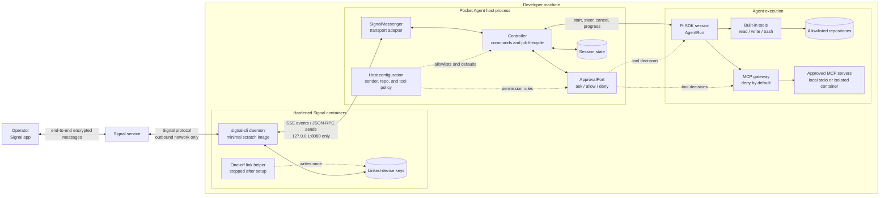

# Pocket Agent

A private Signal control plane for a coding agent running on your machine.

From Signal you can report a bug, start a Pi task in an allowlisted repository, receive progress and final output, answer questions/permission prompts, steer active work, cancel it, and switch between sessions. MCP tools are exposed through a deny-by-default gateway.

> **Early MVP:** use on a development machine with backups. Coding agents and MCP servers can execute code with the daemon user's privileges. Chat approvals reduce accidents; they do not provide process isolation.

## Why Signal first?

Signal works for a private, self-hosted workflow through the unofficial `signal-cli` daemon and does not need a public webhook. WhatsApp support fits the same `Messenger` interface, but its official Cloud API requires business setup, a public webhook, and template handling outside the 24-hour customer-service window. See [`docs/research.md`](docs/research.md).

## Architecture



Commands arrive through the SSE stream; replies and progress use JSON-RPC in the reverse direction. The Signal daemon is isolated from agent execution and exposes its API only on host loopback. The controller accepts only configured senders and repository aliases, while Pi tool calls and MCP calls pass through explicit policy and approval points before reaching local resources.

The deep seams are intentionally small:

- `Messenger`: incoming messages and outbound text. A WhatsApp adapter can replace Signal.
- `AgentFactory` / `AgentRun`: start, steer, cancel and dispose. ACP/Claude Code/Codex adapters can be added later.
- `ApprovalPort`: turns blocking agent questions and tool permissions into chat requests.

## Current capabilities

- `/new <repo> <task>` starts a persistent Pi conversation.
- `/bug <repo> <description>` asks Pi to reproduce, fix and test a bug.
- Plain text or `/steer` continues/redirects the selected session.
- `/answer` resolves agent questions, Pi tool approvals and MCP approvals.
- `/cancel`, `/jobs`, `/use`, and `/status` control concurrent sessions.
- Incoming senders and repositories are host-configured allowlists.
- Pi writes and shell calls default to explicit approval.
- MCP uses local stdio only, absolute executables, no shell, deny-by-default tool policy, timeouts and output limits.
- Signal group messages are ignored in the MVP; only allowlisted private senders are accepted.

## Prerequisites

- Node.js 20.12+
- Pi credentials already configured (`pi /login` or provider API environment variables)
- Docker (recommended for `signal-cli` and MCP isolation)
- A Signal account. Linking `signal-cli` as a secondary device is recommended.

## The Signal image

The repository builds its own image from [`docker/signal-cli/Dockerfile`](docker/signal-cli/Dockerfile). It does **not** download or run `signal-cli-rest-api`.

The long-running image contains only:

- the upstream `signal-cli` native executable;
- its required glibc, libgcc, and zlib runtime files;
- CA certificates needed to reach Signal.

The final image is `FROM scratch`: it has no shell, package manager, curl, Java runtime, or wrapper web application. The upstream `signal-cli` archive is pinned to version `0.13.20` and verified during the build against its published SHA-256 digest. The Debian build-stage image is also digest-pinned.

A separate one-off `link-helper` build target contains `qrencode` and a shell solely to display the device-link QR code. It is not used by the long-running daemon.

## Setup

```bash
npm install
cp config.example.json config.json
mkdir -p signal-cli-data
chmod 700 signal-cli-data

# Build only from this repository's reviewed Dockerfile.
docker compose build --pull

# One-time device linking. Scan the displayed QR in Signal under:
# Settings → Linked devices → +
docker compose --profile setup run --rm signal-link

# Start the minimal daemon after linking completes.
docker compose up -d signal-cli
curl --fail http://127.0.0.1:8080/api/v1/check
```

On Linux, the container runs as UID/GID `65532`. If the link command reports a permission error, set ownership before retrying:

```bash
sudo chown -R 65532:65532 signal-cli-data
```

On Apple Silicon, Compose runs the upstream x86-64 native release under Docker's `linux/amd64` emulation. This is slower at startup but avoids adding a Java runtime or maintaining an unverified custom native build.

Keep `signal-cli-data` private and backed up securely; it contains linked-device cryptographic material. Do not run `signal-link` while the daemon is running because both processes would contend for the same account database.

Edit `config.json`:

- `account`: the linked Signal account in international format.
- `allowedSenders`: exact trusted sender number(s) or UUID(s). Pairing is never performed over chat.
- `repositories`: chat-safe aliases mapped to absolute local paths.
- `agent.model`: optional `provider/model-id`; omit it to use Pi's configured default.
- `permissions`: `allow`, `ask`, or `deny` for reads, writes, and shell calls.

Then:

```bash
npm run check
npm run dev -- ./config.json
```

Send `/help` to the linked account from an allowlisted Signal account.

## Example conversation

```text
You: /bug website checkout hangs after an expired session
Bot: 🚀 [ab12cd34] Starting in website.
Bot: 🔧 read
Bot: ❓ [1] Allow Pi tool bash?
     { "command": "npm test -- checkout" }
     Reply: /answer 1 <answer>
You: /answer 1 yes
Bot: ✅ [ab12cd34]
     Reproduced the race, fixed ..., and all checkout tests pass.
```

## Signal container controls

The daemon runs as numeric user `65532`, with a read-only root filesystem, all Linux capabilities dropped, `no-new-privileges`, and bounded CPU/memory/PIDs. Its sole persistent writable mount is `signal-cli-data`. Port 8080 is published on loopback only. A size-capped ephemeral `/tmp` is executable because the native image must extract and load its bundled `libsignal`; it remains `nosuid,nodev` and disappears with the container.

The container necessarily has outbound network access to communicate with Signal. Pocket Agent talks directly to `signal-cli`'s HTTP JSON-RPC and SSE endpoints; there is no third-party REST wrapper in between. Container isolation reduces attack surface but is not a perfect security boundary, especially under Docker Desktop's VM and x86 emulation.

To inspect exactly what will run:

```bash
docker compose build signal-cli
docker image history --no-trunc pocket-agent/signal-cli:0.13.20
docker inspect pocket-agent/signal-cli:0.13.20
```

## MCP safety model

MCP servers are executable programs, not passive tool descriptions. A malicious server can act as soon as it starts. For that reason:

- MCP config is read only at daemon startup and cannot be changed from Signal.
- Commands must be absolute paths and are spawned directly, without a shell.
- Every server defaults to denying every tool.
- Tool calls can require an operator approval showing their arguments.
- Project and global Pi extensions are disabled for hosted sessions.

For untrusted MCP servers, configure the executable as the absolute Docker/Podman path and use a pinned image digest, `--network=none`, `--read-only`, a non-root user, resource limits, no host secrets, and only narrowly scoped read-only mounts. The example config shows the shape. Do the same for the **agent daemon itself** if you require a hard security boundary.

## Deliberate MVP limits / roadmap

1. Add crash-safe job metadata restoration (Pi transcripts are already persisted, controller job selection is not).
2. Add an official WhatsApp Cloud API adapter with signature verification and webhook deduplication.
3. Add ACP-backed agent adapters for Claude Code, Codex and other clients.
4. Add a first-class container runner for both agents and MCP servers.
5. Add attachments, git worktrees, schedules, and richer progress summaries.

## Development

```bash
npm test
npm run build
npm run check
```

See [`SECURITY.md`](SECURITY.md) before exposing the daemon or adding MCP servers.
