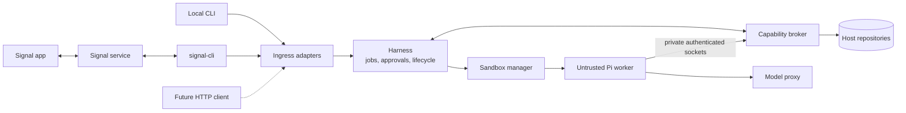

# Pocket Agent

A private, transport-neutral harness for a coding agent running on your machine.

The local CLI, Signal, and future authenticated HTTP endpoints are ingress adapters to the same job harness. An ingress can start a Pi task in an allowlisted repository, receive progress and final output, answer approvals, steer or cancel work, and switch between sessions. MCP tools are exposed through a deny-by-default gateway.

> **Early MVP:** use on a development machine with backups. Pi and its built-in tools run only in a constrained disposable Docker worker. The authenticated broker exposes only scoped workspace operations, and a job-scoped host proxy keeps provider credentials out of workers.

## Ingress adapters

Signal was the first remote adapter because it supports a private, self-hosted workflow through the unofficial `signal-cli` daemon without a public webhook. It is not the harness entry point or part of the domain model. The trusted host is being migrated to Rust with a first-class local CLI; Signal will sit beside it as an optional adapter. See [ADR 0001](docs/adr/0001-rust-host-and-ingress-adapters.md) and [`docs/rust-host.md`](docs/rust-host.md).

## Target architecture



Arbitrary agent-selected commands run only inside a disposable worker. The worker receives a repository copy, not the original host checkout, and has no host home directory, Docker socket, or long-lived credentials. Privileged actions cross an authenticated MCP seam where the trusted capability broker validates job identity, scope, normalized arguments, policy, and operator approval. The broker exposes typed capabilities and never a generic host shell.

Pi execution and built-in tools run in the isolated worker; the host package does not install or initialize Pi. The host issues short-lived, job-scoped broker and model-proxy leases over private Unix sockets with policy checks, limits, revocation, and redacted audit records. Curated workspace capabilities can submit and review a patch; applying it is a separate approved operation. Provider credentials remain in the trusted host. See [`docs/architecture.md`](docs/architecture.md), [`docs/isolation-verification.md`](docs/isolation-verification.md), [`docs/capability-broker.md`](docs/capability-broker.md), [`docs/model-proxy.md`](docs/model-proxy.md), and [`docs/workspaces.md`](docs/workspaces.md).

The deep seams are intentionally small:

- `Harness`: accepts transport-neutral commands identified by principal and conversation and emits structured replies.
- Ingress adapters authenticate principals and translate CLI, Signal, or future HTTP traffic at that seam.
- `JobFactory` / `JobHandle`: create, run, steer, cancel and dispose isolated jobs without exposing Docker or workspace details to the harness.
- `JobEventPort`: reports status and requests one-operation approvals during a turn.

## Current capabilities

The Rust host now supports a one-turn CLI and an interactive shell:

```bash
cargo run --release -- --config ./config.json run --repo app --prompt "Fix the parser"
cargo run --release -- --config ./config.json run --repo app --bug "Parser panics on empty input"
cargo run --release -- --config ./config.json shell --repo app
```

It uses the same hardened Docker worker, disposable workspace, and host-only model credential path. Signal currently remains on the legacy TypeScript host while its optional Rust ingress adapter is ported.

- `/new <repo> <task>` starts a persistent Pi conversation through Signal.
- `/bug <repo> <description>` asks Pi to reproduce, fix and test a bug.
- Plain text or `/steer` continues/redirects the selected session.
- `/answer` resolves agent questions, Pi tool approvals and MCP approvals.
- `/cancel`, `/jobs`, `/use`, and `/status` control concurrent sessions.
- Incoming senders and repositories are host-configured allowlists.
- Jobs use bounded disposable repository snapshots; candidate patches are exported with a changed-file manifest while the original checkout remains untouched.
- Pi writes and shell calls default to explicit approval.
- Privileged host operations are available only through authenticated, job-scoped broker capabilities.
- Signal group messages are ignored in the MVP; only allowlisted private senders are accepted.

## Prerequisites

- Rust 1.85+ for the new trusted-host harness
- Node.js 20.12+ while the TypeScript host remains during migration and for worker dependency builds
- A digest-pinned Pocket Agent worker image built from this repository
- Docker (recommended for `signal-cli` and MCP isolation)
- A Signal account. Linking `signal-cli` as a secondary device is recommended.

## The worker image

The pinned, multi-platform worker image packages Pi and baseline build tools under numeric UID/GID `65532`. Its protocol entrypoint owns the in-memory Pi session, built-in tools, steering, cancellation, status, and tool approvals. It runs with a read-only root filesystem and contains no credentials or container client. See [`docs/worker-image.md`](docs/worker-image.md) for builds, hardened smoke tests, SBOM inspection, and the update procedure. The [`DockerSandboxRunner`](docs/docker-sandbox.md) adds per-job resource, filesystem, network, lifecycle, and cleanup controls.

## The Signal image

The repository builds its own image from [`docker/signal-cli/Dockerfile`](docker/signal-cli/Dockerfile). It does **not** download or run `signal-cli-rest-api`.

The long-running image contains only:

- the upstream `signal-cli` native executable;
- its required glibc, libgcc, and zlib runtime files;
- CA certificates needed to reach Signal.

The final image is `FROM scratch`: it has no shell, package manager, curl, Java runtime, or wrapper web application. The upstream `signal-cli` archive is pinned to version `0.13.20` and verified during the build against its published SHA-256 digest. The Debian build-stage image is also digest-pinned.

A separate one-off `link-helper` build target contains `qrencode` and a shell solely to display the device-link QR code. It is not used by the long-running daemon.

## Setup

```bash
npm install
cp config.example.json config.json
mkdir -p signal-cli-data
chmod 700 signal-cli-data

# Build only from this repository's reviewed Dockerfile.
docker compose build --pull

# One-time device linking. Scan the displayed QR in Signal under:
# Settings → Linked devices → +
docker compose --profile setup run --rm signal-link

# Start the minimal daemon after linking completes.
docker compose up -d signal-cli
curl --fail http://127.0.0.1:8080/api/v1/check
```

On Linux, the container runs as UID/GID `65532`. If the link command reports a permission error, set ownership before retrying:

```bash
sudo chown -R 65532:65532 signal-cli-data
```

On Apple Silicon, Compose runs the upstream x86-64 native release under Docker's `linux/amd64` emulation. This is slower at startup but avoids adding a Java runtime or maintaining an unverified custom native build.

Keep `signal-cli-data` private and backed up securely; it contains linked-device cryptographic material. Do not run `signal-link` while the daemon is running because both processes would contend for the same account database.

Build the worker and copy its local digest into `sandbox.image`:

```bash
docker buildx build --load --file docker/worker/Dockerfile --tag pocket-agent/worker:0.1.0 .
docker image inspect pocket-agent/worker:0.1.0 --format '{{index .RepoDigests 0}}'
```

Edit `config.json`:

- `account`: the linked Signal account in international format.
- `allowedSenders`: exact trusted sender number(s) or UUID(s). Pairing is never performed over chat.
- `repositories`: chat-safe aliases mapped to absolute local paths.
- `sandbox.image`: the complete digest-pinned worker image reference from the build.
- `agent.model`: required `provider/model-id`, fixed for all job leases.
- `agent.apiKeyEnv`: host environment variable containing that provider's API key; its value is never passed to workers.
- `permissions`: `allow`, `ask`, or `deny` for reads, writes, and shell calls inside the worker.

Then export only the configured host credential. Run the Rust CLI locally, or start the legacy Signal adapter during migration:

```bash
export ANTHROPIC_API_KEY='...'

# First-class local ingress
cargo run --release -- --config ./config.json run --repo app --prompt "Review this repository"

# Signal ingress during the Rust migration
npm run check
npm run dev -- ./config.json
```

Use the variable named by `agent.apiKeyEnv`; the example above matches `config.example.json`.

Send `/help` to the linked account from an allowlisted Signal account.

## Example conversation

```text
You: /bug website checkout hangs after an expired session
Bot: 🚀 [ab12cd34] Starting in website.
Bot: 🔧 read
Bot: ❓ [1] Allow Pi tool bash?
     { "command": "npm test -- checkout" }
     Reply: /answer 1 <answer>
You: /answer 1 yes
Bot: ✅ [ab12cd34]
     Reproduced the race, fixed ..., and all checkout tests pass.
```

## Signal container controls

The daemon runs as numeric user `65532`, with a read-only root filesystem, all Linux capabilities dropped, `no-new-privileges`, and bounded CPU/memory/PIDs. Its sole persistent writable mount is `signal-cli-data`. Port 8080 is published on loopback only. A size-capped ephemeral `/tmp` is executable because the native image must extract and load its bundled `libsignal`; it remains `nosuid,nodev` and disappears with the container.

The container necessarily has outbound network access to communicate with Signal. Pocket Agent talks directly to `signal-cli`'s HTTP JSON-RPC and SSE endpoints; there is no third-party REST wrapper in between. Container isolation reduces attack surface but is not a perfect security boundary, especially under Docker Desktop's VM and x86 emulation.

To inspect exactly what will run:

```bash
docker compose build signal-cli
docker image history --no-trunc pocket-agent/signal-cli:0.13.20
docker inspect pocket-agent/signal-cli:0.13.20
```

## Capability safety model

The old host-side MCP extension was removed with host-side Pi. MCP servers are executable programs, not passive tool descriptions, so workers reach privileged operations only through the authenticated, scoped capability broker. The broker registers only curated workspace metadata, patch submission/status, and approved patch application operations; it exposes no host path or shell. Docker workers retain `network=none` and receive no host or provider credentials. Native Linux Docker supports the private Unix-socket mount; Docker Desktop for macOS fails capability access closed because its VM cannot forward host Unix sockets.

## Deliberate MVP limits / roadmap

1. Add additional narrowly scoped connector capabilities as needed.
2. Add crash-safe controller job metadata restoration; worker Pi sessions are intentionally in-memory today.
3. Add an official WhatsApp adapter.
4. Add attachments, schedules, and richer progress summaries.

## Development

```bash
npm test
npm run build
npm run check
```

See [`SECURITY.md`](SECURITY.md) before exposing the daemon or adding MCP servers.
