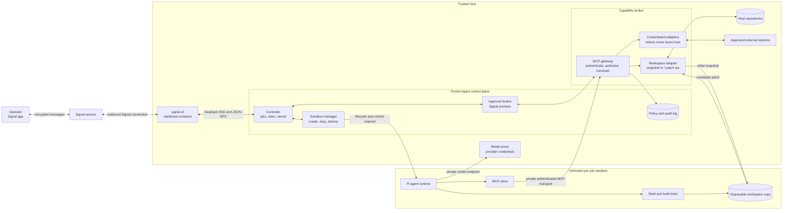

# Target architecture: isolated workers and a capability broker

Pocket Agent should treat agent-generated code, shell commands, and MCP clients as untrusted. The trusted control plane may coordinate work, but it must not execute agent-selected commands or expose the host filesystem directly.

## System diagram



## Core rule

Arbitrary execution happens only inside a disposable worker sandbox. The host capability broker performs a small set of typed operations; it never provides a generic `host.exec` tool.

An agent can run `npm test` against `/workspace` inside its sandbox. It cannot run a command in the original host repository, read the host home directory, access the Docker socket, or receive long-lived provider and connector credentials.

## Modules and seams

### Sandbox manager

The `SandboxRunner` interface should stay small:

```ts
interface SandboxRunner {
  create(spec: JobSandboxSpec): Promise<SandboxJob>;
}

interface JobSandboxSpec {
  id: string;
  workspacePath: string;
  conversationId: string;
  repositoryScope: string;
  deadlineAt: Date;
  outputLimitBytes: number;
  events: {
    status(message: string): Promise<void>;
    approval?(request: SandboxApprovalRequest): Promise<string>;
  };
}

interface SandboxJob {
  start(prompt: string): Promise<string>;
  steer(message: string): Promise<void>;
  cancel(): Promise<void>;
  dispose(): Promise<void>;
}
```

Its implementation owns container or VM creation, limits, networking, workspace initialization, process supervision, and cleanup. The first adapter and its effective controls are documented in [`docker-sandbox.md`](docker-sandbox.md); a VM or native OS sandbox can be added at the same seam later. The versioned start, steer, cancel, status, completion, and failure messages—and their lifecycle invariants—are specified in [`worker-protocol.md`](worker-protocol.md).

### Capability broker

The capability broker exposes curated MCP tools such as:

- `workspace.read_metadata`
- `workspace.submit_patch`
- `github.get_issue`
- `github.create_pull_request`
- `secrets.perform_operation`

Each call is evaluated server-side against the authenticated job identity, repository scope, normalized arguments, configured policy, call and output limits, and any required operator approval. Configuration is loaded by the trusted host and cannot be modified through Signal or by the worker. The authenticated transport, lease lifecycle, audit format, and Linux platform constraint are documented in [`capability-broker.md`](capability-broker.md).

Approvals authorize one normalized operation, not a tool forever. An approval record binds the job ID, tool name, canonical argument digest, lease expiry, and a one-time request nonce. The broker re-authenticates after the answer, so cancellation or expiry wins approval races. Cancellation revokes outstanding approvals and the job's broker lease.

### Workspace adapter

The original host checkout is not mounted into the worker. The workspace adapter creates a disposable copy or worktree for the job and imports it into a sandbox-owned volume. When work completes, it returns a patch for review or applies an explicitly approved patch through the broker.

This avoids giving compromised worker code a path to unrelated repositories, host Git configuration, SSH keys, or editor credentials. Snapshot validation, patch limits, and crash-recovery cleanup are detailed in [`workspaces.md`](workspaces.md).

### Model proxy

The worker needs model access but should not receive the operator's provider credentials. A narrow proxy owns those credentials, binds requests to a job, restricts providers/models, and applies token and rate limits. The worker network allows only the model proxy and MCP gateway unless a job receives a specific egress capability.

## Sandbox invariants

A job worker should have:

- a pinned, read-only runtime image;
- a non-root user and no added capabilities;
- no host home directory, original repository, credential store, or Docker socket;
- one writable disposable workspace and bounded temporary storage;
- CPU, memory, PID, runtime, and output limits;
- no inbound host ports;
- denied network egress except private broker/model endpoints;
- a per-job identity and short-lived broker credential;
- forced termination and capability revocation on cancel or timeout.

MCP is the mediation protocol, not the isolation mechanism. The sandbox provides isolation; the broker provides narrowly scoped access through explicit capabilities.

## Request flow

1. An allowlisted Signal sender starts a job using a configured repository alias.
2. The controller resolves the alias; the raw host path is never accepted from chat.
3. The workspace adapter prepares a disposable repository snapshot.
4. The sandbox manager starts a worker with that snapshot and a per-job identity.
5. Pi may execute arbitrary build commands only inside the worker.
6. A privileged operation is requested as an MCP tool call to the capability broker.
7. The broker denies it, allows it by policy, or asks the operator through Signal.
8. If approved, the broker performs exactly the normalized operation and records the result.
9. The worker submits a patch. Applying it to the host repository remains a separate policy or approval decision.
10. Completion, cancellation, or timeout revokes the job identity and destroys the worker.

## Current implementation gap

Pi, its built-in read/write/bash tools, and its in-memory session now run only inside the Docker worker. The host package no longer installs Pi or exposes a host-side agent/MCP adapter. Workers receive only a disposable workspace, safe model-selection metadata, and normalized approval responses; they receive no host environment or credentials.

The host now exposes an authenticated, job-scoped MCP broker over a private Unix socket mounted read-only into native Linux workers. No production capabilities are registered yet; issue #7 adds workspace tools. The credential-free model proxy is also pending, so production workers still cannot reach model providers. Docker Desktop for macOS cannot forward the host Unix socket and fails capability access closed. Approvals reduce accidental tool use inside the disposable workspace; sandbox isolation—not approval—is the security seam.

## Recommended migration order

1. Define the sandbox job protocol and add a fake `SandboxRunner` for controller tests.
2. Package a pinned worker image containing Pi and required build tools.
3. Give every job a disposable workspace copy; remove direct host repository access from Pi.
4. Run shell/read/write only in the worker and enforce hard resource limits.
5. Move the MCP gateway to the trusted host and add per-job authentication and scope enforcement.
6. Add a model proxy so provider credentials do not enter workers.
7. Make patch export/application an explicit capability with approval and audit records.
8. Add adversarial integration tests for path traversal, symlinks, cancellation, credential leakage, network escape, replayed approvals, and orphaned workers.
