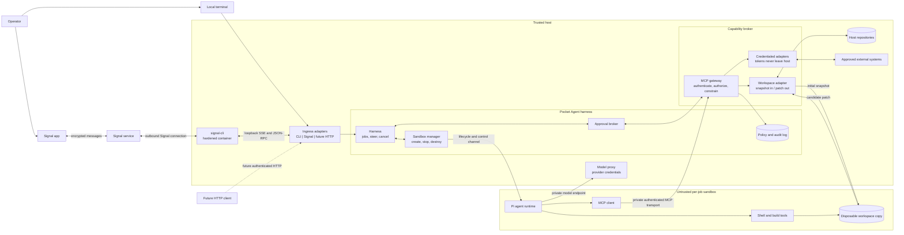

# Target architecture: isolated workers and a capability broker

Pocket Agent is a secure remote wrapper around replaceable coding agents, not an agent framework. It treats prompts, repository content, model output, agent-generated code, shell commands, agent runtimes, and MCP clients as untrusted. The trusted control plane may coordinate work, but it must not execute agent-selected commands or expose the host filesystem directly. Product boundaries and feature admission rules are defined in the [`architectural review`](architectural-review.md) and [ADR 0002](adr/0002-secure-wrapper-not-agent-framework.md).

## System diagram



## Core rule

The harness is transport-neutral. CLI, Signal, and future HTTP entry points are ingress adapters that authenticate a principal and translate requests/replies; no ingress can bypass repository aliases, approvals, job ownership, or sandbox policy.

Arbitrary execution happens only inside a disposable worker sandbox. The host capability broker performs a small set of typed operations; it never provides a generic `host.exec` tool.

An agent can run `npm test` against `/workspace` inside its sandbox. It cannot run a command in the original host repository, read the host home directory, access the Docker socket, or receive long-lived provider and connector credentials.

## Modules and seams

### Sandbox manager

The Rust `JobFactory`/`JobHandle` interface stays small:

```rust
trait JobFactory {
    async fn create(&self, spec: JobSpec) -> Result<Arc<dyn JobHandle>>;
    fn repositories(&self) -> Vec<String>;
}

trait JobHandle {
    async fn run_turn(&self, prompt: &str, events: Arc<dyn JobEventPort>) -> Result<TurnResult>;
    async fn steer(&self, message: &str) -> Result<()>;
    async fn cancel(&self) -> Result<()>;
}
```

Its implementation owns container or VM creation, limits, networking, workspace initialization, process supervision, and cleanup. The first adapter and its effective controls are documented in [`docker-sandbox.md`](docker-sandbox.md); a VM or native OS sandbox can be added at the same seam later. The versioned start, steer, cancel, status, completion, and failure messages—and their lifecycle invariants—are specified in [`worker-protocol.md`](worker-protocol.md).

### Capability broker

The capability broker always exposes four curated workspace tools:

- `workspace.read_metadata`
- `workspace.submit_patch`
- `workspace.get_patch_status`
- `workspace.apply_patch`

It may also expose a trusted configuration's exact Arcade capability allowlist through the host-side provider seam. Arcade discovery cannot add tools, and remote ingress receives none in the initial local-only implementation.

Each call is evaluated server-side against the authenticated job identity, repository scope, normalized arguments, configured policy, call and output limits, and any required operator approval. Configuration is loaded by the trusted host and cannot be modified through an ingress or by the worker. The authenticated transport, lease lifecycle, audit format, and runner constraints are documented in [`capability-broker.md`](capability-broker.md).

Approvals authorize one normalized operation, not a tool forever. An approval record binds the job ID, tool name, canonical argument digest, lease expiry, and a one-time request nonce. The broker re-authenticates after the answer, so cancellation or expiry wins approval races. Cancellation revokes outstanding approvals and the job's broker lease.

### Workspace adapter

The original host checkout is not mounted into the worker. The workspace adapter creates a disposable copy or worktree for the job and imports it into a sandbox-owned volume. When work completes, it returns a patch for review or applies an explicitly approved patch through the broker.

This avoids giving compromised worker code a path to unrelated repositories, host Git configuration, SSH keys, or editor credentials. Snapshot validation, patch limits, and crash-recovery cleanup are detailed in [`workspaces.md`](workspaces.md).

### Model proxy

The worker reaches a narrow host proxy over a private Unix socket and never receives provider credentials. The proxy binds requests to a job, fixes the configured provider/model and destination, applies concurrency, token, rate, byte, and timeout limits, redacts operational records, and revokes access with the sandbox. Details are in [`model-proxy.md`](model-proxy.md). Docker workers retain `network=none`, and native workers use deny-by-default network policy; the broker and model proxy are explicit private endpoints, not general egress.

## Sandbox invariants

Every job worker must have:

- no host home directory, original repository, credential store, ambient host environment, or container-management socket;
- a writable disposable workspace separated from trusted workspace metadata;
- denied general network egress, with only authenticated private broker/model endpoints;
- a per-job identity and short-lived credentials;
- runtime and protocol-output limits;
- forced process-tree termination and capability revocation on cancellation, timeout, or failure;
- no unrestricted fallback when an isolation control is unavailable.

The hardened Docker runner additionally provides a pinned read-only image, a non-root user, dropped capabilities, and CPU, memory, PID, open-file, and storage limits. Native OS runners must document weaker or platform-specific controls and may not claim Docker-equivalent isolation. The current macOS runner lacks equivalent CPU, memory, PID, and disk quotas.

MCP is the mediation protocol, not the isolation mechanism. The sandbox provides isolation; the broker provides narrowly scoped access through explicit capabilities. No runner provides “complete” isolation against compromise of its kernel, runtime, trusted host, or dependency supply chain.

## Request flow

1. An allowlisted Signal sender starts a job using a configured repository alias.
2. The harness resolves the alias; the raw host path is never accepted from chat.
3. The workspace adapter prepares a disposable repository snapshot.
4. The sandbox manager starts a worker with that snapshot and a per-job identity.
5. Pi may execute arbitrary build commands only inside the worker.
6. A privileged operation is requested as an MCP tool call to the capability broker.
7. The broker denies it, allows it by policy, or asks the operator through Signal.
8. If approved, the broker performs exactly the normalized operation and records the result.
9. The worker submits a patch. Applying it to the host repository remains a separate policy or approval decision.
10. Cancellation, timeout, failure, or host shutdown revokes the job identity and destroys the worker. A successful turn may leave the job idle for a later turn in the same in-memory Pi session.

## Current implementation

Pi, its built-in read/write/bash tools, and its in-memory session now run only inside a Docker or native macOS worker. The host package no longer installs Pi or exposes a host-side agent/MCP adapter. Workers receive only a disposable workspace, safe model-selection metadata, and normalized approval responses; they receive no host environment or credentials.

The host exposes authenticated, job-scoped broker and model-proxy Unix sockets to native Linux Docker workers and native macOS Seatbelt workers. The worker registers its scoped tools and proxy provider with Pi. The broker exposes only metadata, patch submission/status, and separately approved patch application; the model proxy fixes one trusted provider/model without disclosing its credential. Docker Desktop for macOS cannot forward host Unix sockets and fails both paths closed; the native runner does not cross that VM boundary. Approvals reduce accidental tool use inside the disposable workspace; sandbox isolation—not approval—is the security seam.

The trusted host is one Rust binary with transport-neutral commands and structured replies. It contains the CLI and optional Signal ingress, disposable workspace manager, sandbox lifecycle adapters, scoped capability broker, and native model proxy. The legacy TypeScript host and its dependency tree have been removed. Pi and Node remain confined to the untrusted worker process; the native macOS runner requires a host-installed Node executable but does not load it into the trusted Rust process. See [ADR 0001](adr/0001-rust-host-and-ingress-adapters.md), [ADR 0002](adr/0002-secure-wrapper-not-agent-framework.md), and [`rust-host.md`](rust-host.md).
